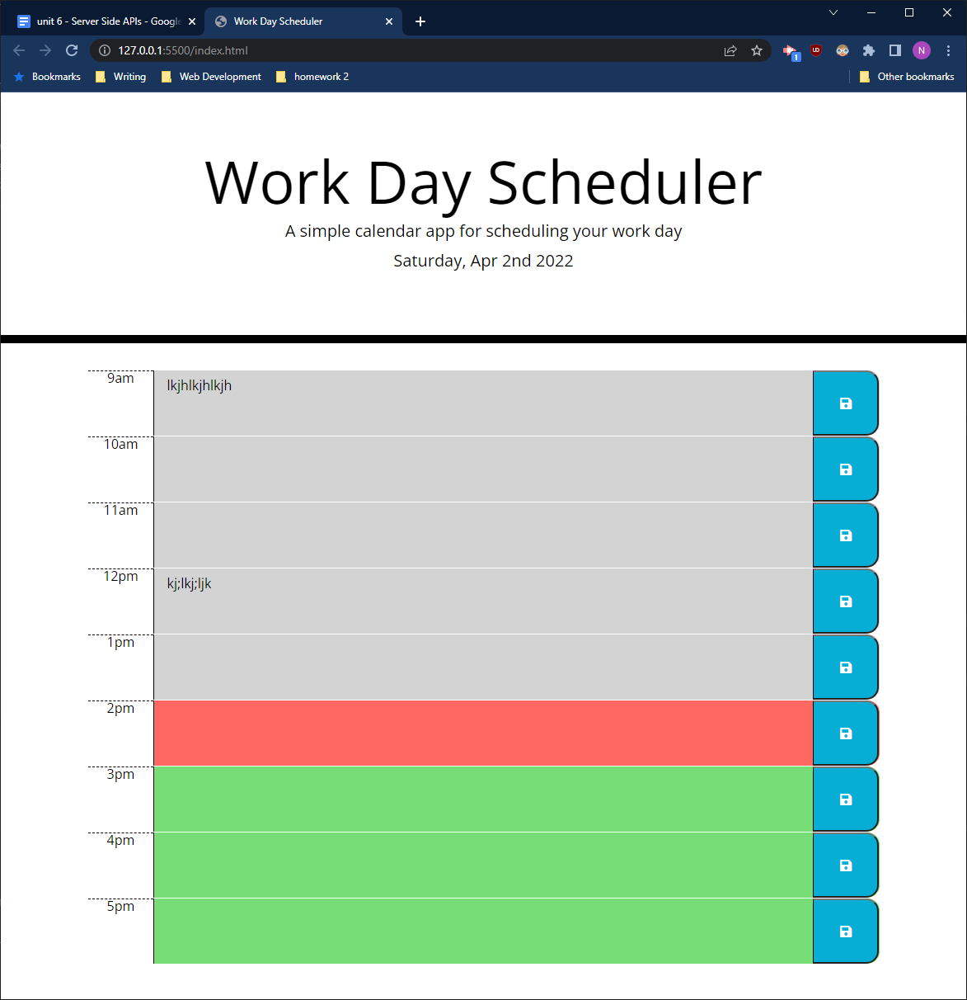

# Work Day Scheduler

Work scheduler is a simple day planner that can store text for each hour of the work day. 

## Description 

Work Day Scheduler provides a simple way to plan each hour of your day. For each hour of the day, you can write down what you need to do, and save that text with the save button so that it remains even if you reload the page. Hour blocks change color throughout the day. Gray blocks represent hours that have already passed, a red block will indicate the current hour and green blocks indicate future hours of the day. 

##Features

- HTML
- CSS
- Bootstrap
- jQuery
- Moment.js 
## Websites

You can install this webapp locally by cloning the repo from Github, available [here](https://github.com/noahneville/work-day-scheduler).

Alternatively, you can view and use the webapp deployed live, available [here](https://noahneville.github.io/work-day-scheduler).

## Acknowledgements

As always, thanks to the members of my study group. 
  
    - Seamona Stewart 
    - James Edwards
    - Eric Hurst
    - James Edwards
    - Jason Couch
    - Anthony Chang
    - Sarah Gilbreath 

Thanks to my tutor, Dan Ringenbach, for helping me understand and implement local storage. 

Save Button Icon from Font Awesome.

### License

[MIT](https://opensource.org/licenses/MIT)
